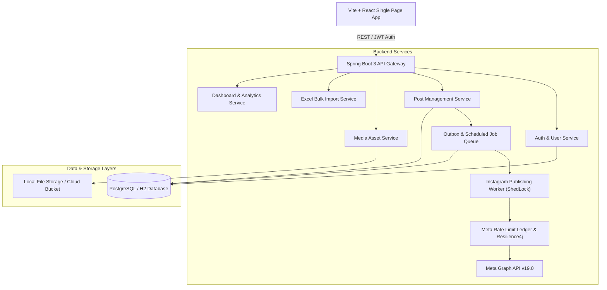
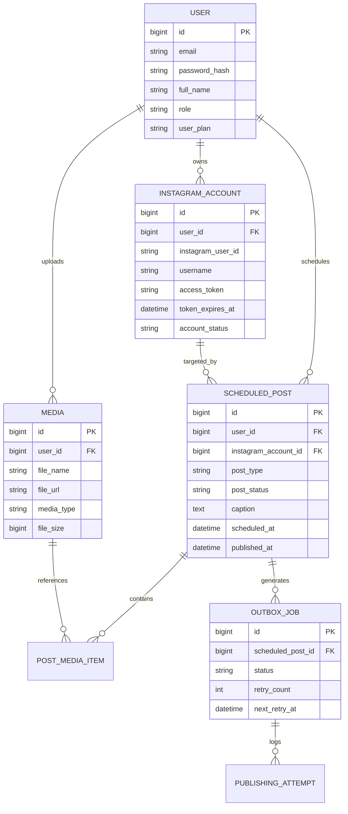

# InstaMngmt — Feature, Requirement & Functional Specification Document

## 1. Executive Summary

**InstaMngmt** is an enterprise-grade Instagram Content Management, Scheduling, and Automated Publishing Platform. Built with a robust Java 21 / Spring Boot 3 backend and a modern React / TypeScript frontend powered by Vite and Tailwind-inspired styling, InstaMngmt enables content creators, social media managers, and marketing agencies to schedule, curate, and publish Instagram posts (Single Image, Carousel, and Reels) seamlessly using Meta's Graph API.

Key highlights of the system include:
- **Transactional Outbox & Distributed Worker**: Reliable scheduled publishing with ShedLock leader election to prevent duplicate publishing across clustered instances.
- **Bulk Excel Import Engine**: High-throughput ingestion of scheduled content from Excel spreadsheets with validation and error diagnostics.
- **Rate Limit & Resilience Engine**: Active ledger tracking of Meta API quota limits with Resilience4j circuit breakers and automatic exponential backoff retry mechanics.
- **Tiered Multi-Tenant Architecture**: Plan-based user capability management (FREE, PRO, ENTERPRISE) regulating media storage caps, linked account limits, and posting velocity.

---

## 2. System Architecture & High-Level Design

---

## 3. Functional Requirements & Features

### 3.1 User Authentication & Account Management
* **User Registration & Login**: Email/password authentication secured by JWT (JSON Web Tokens) with configurable expiration.
* **Role-Based Access Control (RBAC)**: User roles (`ROLE_USER`, `ROLE_ADMIN`) with administrative privileges for system settings and user management.
* **Subscription Tiers**: Support for `FREE`, `PRO`, and `ENTERPRISE` plans enforcing quota limits:
  * Maximum linked Instagram accounts.
  * Maximum media storage limit (in MB/GB).
  * Maximum scheduled posts per month.
* **Password Reset & Profile Management**: Self-service password recovery flow with secure token validation.

### 3.2 Instagram Account Integration
* **OAuth 2.0 Integration**: Secure Meta Graph API authorization flow to link Instagram Business / Creator accounts.
* **Account Status Tracking**: Real-time display of token expiration dates, connection health, user handle, profile metadata, and quick re-authentication triggers.
* **Multi-Account Support**: Ability to manage and publish across multiple linked accounts based on user plan limits.

### 3.3 Media Asset Management
* **Multi-Format Uploads**: Support for standard images (JPEG, PNG, WEBP) and video files (MP4, MOV) optimized for Instagram feed posts and Reels.
* **Media Library**: Searchable asset repository with tag filtering, file size usage indicators, upload timestamps, and direct preview capabilities.
* **Local Storage & Cleanup**: File system storage abstraction with orphan asset cleanup routines.

### 3.4 Post Creation & Content Studio
* **Supported Post Formats**:
  1. **Single Image Post**: High-resolution feed photo publishing with caption and hashtags.
  2. **Carousel Post**: Multi-media posts (up to 10 images/videos) with ordered drag-and-drop reordering.
  3. **Reels**: Short-form video posts with custom thumbnail selection and caption customization.
* **Drafting & Scheduling**: Option to save posts as `DRAFT`, publish immediately (`PUBLISH_NOW`), or schedule for future automated publishing (`SCHEDULED`).
* **Live Instagram Preview**: Real-time visual feed preview rendering how the post will appear on mobile screens (captions, user handles, media layout).
* **AI Caption Helper & Formatting**: Integrated caption generation suggestions, hashtag manager, and emoji selectors.

### 3.5 Bulk Excel Import Engine
* **Excel Template Ingestion**: Downloadable `.xlsx` template with separate columns for `Schedule Date` (`YYYY-MM-DD`) and `Schedule Time` (`HH:mm:ss`), media URLs, caption text, post type, and location.
* **Native Excel Dropdown Constraints**: The generated template incorporates Apache POI `DataValidation` dropdown list on the `Post Type` column restricting choices to `IMAGE`, `REEL`, `STORY`, `CAROUSEL`, and `VIDEO`.
* **Dual-Column Date & Time Processing Engine**:
  * **Raw Excel Input Storage**: Captures separate `scheduleDateStr` (Col 3) and `scheduleTimeStr` (Col 4) from distinct template columns for granular field validation.
  * **Frontend Preview Formatting**: Generates `scheduledTimeStr` (`yyyy-MM-dd HH:mm:ss`) as a uniform combined timestamp string for UI rendering in the preview modal.
  * **Combined DB Persistence**: Merges date and time into a single Java `LocalDateTime` object (`scheduledTime`), saved into the database table column (`scheduled_at`).
  * **Backward Compatibility**: Automatically falls back to parse single-column combined datetime formats from legacy templates.
* **Strict Validation & Human-Readable Error Diagnostics**: Field-prefixed error messages (e.g., `[Post Type]`, `[Schedule Date]`, `[Schedule Time]`, `[Media Source URL]`, `[Caption & Hashtags]`) explaining exact row mismatches so users can quickly fix errors.
* **Multithreaded Batch Execution**: Parallel batch persistence powered by Java `ExecutorService` for high-throughput batch import processing.

### 3.6 Interactive Calendar & Post Schedule
* **Monthly / Weekly Calendar Views**: Visual schedule calendar showing past, pending, and scheduled posts.
* **Status Filtering**: Filter calendar posts by status (`SCHEDULED`, `PUBLISHED`, `FAILED`, `CANCELLED`, `DRAFT`).
* **Reschedule Action**: Drag/click interaction to adjust scheduled publishing dates and times.

### 3.7 Automated Publishing Worker & Resilience
* **Distributed Leader-Elected Scheduler**: Powered by ShedLock to ensure only a single worker instance executes the publishing queue in clustered deployments.
* **Transactional Outbox Pattern**: Job events are written to `outbox_jobs` database tables to guarantee at-least-once publishing delivery without losing state upon crashes.
* **Rate-Limit Ledger**: Active tracking of Meta Graph API rate-limit headers (X-App-Usage / X-Business-Use-Case) with dynamic backoff when usage reaches critical thresholds (>80%).
* **Error Classification & Retry Policy**: Automatic categorizing of Meta API errors (e.g., transient network issues vs. expired access tokens) with Resilience4j retry rules.

### 3.8 Dashboard, Analytics & System Metrics
* **Metrics Summary**: Overview cards displaying total posts published, pending queue size, failed publishing rate, active linked accounts, and storage utilization.
* **Publishing History & Diagnostics**: Detailed table of past publishing attempts including exact API response payloads, error codes, and execution timestamps.
* **Admin Console**: Global settings toggle, user tier configuration, system health monitors via Spring Boot Actuator endpoints.

---

## 4. Non-Functional Requirements

| Category | Requirement | Specification / Implementation |
| :--- | :--- | :--- |
| **Performance** | API Response Time | Sub-200ms API response time for non-media endpoints. |
| **Reliability** | Zero Duplicate Publishing | Guaranteed via ShedLock distributed lock and database row locking on post states. |
| **Scalability** | Horizontal Scaling | Stateless REST backend layer supporting deployment across multiple container instances. |
| **Security** | Authentication & Encryption | Passwords hashed using BCrypt (`strength=12`), stateless JWT signed with HMAC-SHA256, HTTPS enforcement for Meta Webhooks. |
| **Maintainability** | Clean Architecture | Layered Spring Boot structure (Controller -> Service -> Repository -> Outbox Worker). |
| **Extensibility** | Cloud Media Ready | Modular `StorageService` interface allowing seamless switch between local disk and AWS S3 / Cloud Storage. |

---

## 5. System Data Model & Database Entities

---

## 6. Key API Endpoints Reference

### 6.1 Authentication API (`/api/v1/auth`)
* `POST /api/v1/auth/register` — Create new user account.
* `POST /api/v1/auth/login` — Authenticate and receive JWT token.
* `POST /api/v1/auth/forgot-password` — Request password reset email/token.
* `POST /api/v1/auth/reset-password` — Complete password reset.

### 6.2 Instagram Integration API (`/api/v1/instagram`)
* `GET /api/v1/instagram/connect-url` — Obtain Meta OAuth authorization URL.
* `GET /api/v1/instagram/callback` — Process Meta authorization code exchange.
* `GET /api/v1/instagram/accounts` — List linked Instagram Business accounts.
* `DELETE /api/v1/instagram/accounts/{id}` — Unlink Instagram account.

### 6.3 Post Management & Excel Bulk API (`/api/posts`)
* `GET /api/posts` — Fetch list of user's scheduled posts.
* `POST /api/posts` — Create a new draft, immediate, or scheduled post.
* `GET /api/posts/{id}` — Fetch specific scheduled post by ID.
* `GET /api/posts/calendar` — Fetch posts for calendar view across date range.
* `POST /api/posts/{id}/cancel` — Cancel a scheduled post.
* `POST /api/posts/{id}/retry` — Retry publishing a failed post.
* `DELETE /api/posts/{id}` — Delete a post.
* `GET /api/posts/excel-template` — Download `.xlsx` template with separate Schedule Date & Schedule Time columns.
* `POST /api/posts/upload-excel` — Upload Excel spreadsheet to parse, validate, and preview rows.
* `POST /api/posts/commit-excel-batch` — Commit previewed Excel rows into the database using multithreaded processing.

### 6.4 Media Library API (`/api/v1/media`)
* `POST /api/v1/media/upload` — Upload media asset (Image/Video).
* `GET /api/v1/media` — List uploaded assets with pagination and tag search.
* `DELETE /api/v1/media/{id}` — Delete media asset.

### 6.5 Analytics & Settings API (`/api/v1/dashboard` & `/api/v1/admin`)
* `GET /api/v1/dashboard/stats` — Fetch user publishing metrics and storage quotas.
* `GET /api/v1/admin/settings` — Admin system settings configuration.
* `POST /api/v1/admin/settings` — Update site settings (Admin only).

---

## 7. Technology Stack Summary

### Backend
* **Language**: Java 21 LTS
* **Framework**: Spring Boot 3.3.4 (Web, Security, Data JPA, Actuator, WebFlux)
* **Database**: PostgreSQL (Production) / H2 (Development & Testing)
* **Distributed Locking**: ShedLock JDBC Provider
* **Resilience**: Resilience4j (Circuit Breaker & Retry)
* **JWT**: `io.jsonwebtoken` (0.12.6)
* **Excel Parsing**: Apache POI (`poi-ooxml` 5.2.5)

### Frontend
* **Core**: React 18, TypeScript, Vite
* **Routing**: React Router DOM v6
* **Styling**: Tailwind CSS / Custom CSS system
* **Icons**: Lucide React
* **State & API**: Axios with Auth Interceptors, Context API

---

## 8. Summary of Completed Capabilities & Next Steps

### Completed Features
✅ Secure JWT Authentication & Tiered Subscription Engine  
✅ Instagram Business OAuth 2.0 Integration & Token Management  
✅ Post Creator Studio supporting Single Image, Carousel (up to 10 items), and Reels  
✅ Excel Spreadsheet Bulk Scheduling Engine with validation  
✅ Outbox Pattern Scheduler with ShedLock leader election for cluster safety  
✅ Active Meta Rate Limiting Ledger and Error Diagnostics  
✅ Interactive Scheduling Calendar and Media Library  
✅ Responsive Admin Console and User Dashboard  

### Recommended Future Enhancements
1. **Cloud Media Storage Provider**: Integrate S3/GCS drivers for multi-node media distribution.
2. **Meta Webhook Handling**: Real-time notification updates when published Instagram posts gain comments or insights.
3. **Advanced AI Content Generator**: LLM prompt integration directly inside the Post Studio for generating captions, hashtags, and optimal posting times.
