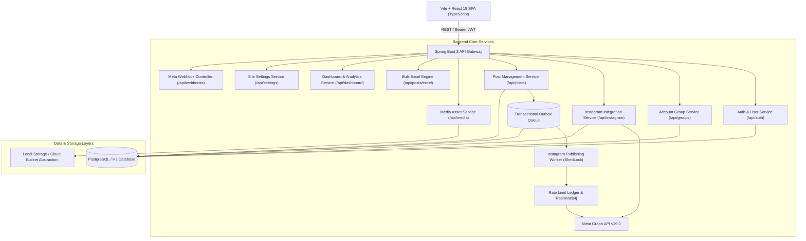
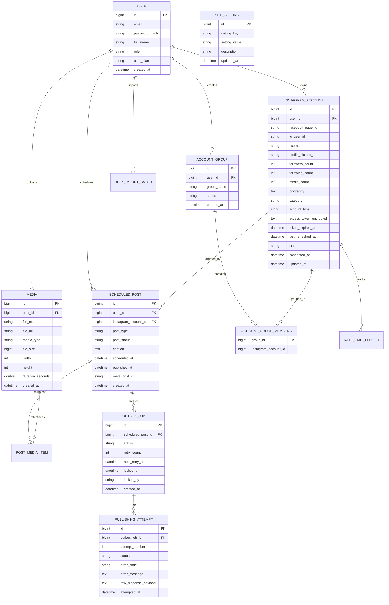

# InstaMngmt — Feature, Requirement & Functional Specification Document

## 1. Executive Summary

**InstaMngmt** is an enterprise-grade Instagram Content Management, Scheduling, and Automated Publishing Platform. Built with a high-performance **Java 21 / Spring Boot 3** backend and a reactive **React 18 / TypeScript / Vite** frontend with a custom glassmorphism SaaS design system, InstaMngmt enables content creators, social media marketing teams, and digital agencies to curate, organize, schedule, and publish Instagram content (Single Image, Carousel, and Reels) reliably via Meta's Graph API.

Key architectural highlights of the platform:
- **Transactional Outbox & Distributed Worker**: Reliable scheduled publishing backed by ShedLock distributed leader election to eliminate duplicate publishing across clustered instances.
- **Instagram Account Intelligence & Live Sync**: Real-time profile metadata synchronization (followers, following, media counts, bio, avatars) with interactive live countdown timers for token expiration and in-place credential management.
- **Multi-Account Organization & Groups**: Workspace-level account grouping allowing teams to segregate and manage social accounts by client, brand, or campaign.
- **Dual-Engine Post Creation Studio**: Dedicated workflows for single-post scheduling with media previews, alongside a high-throughput **Bulk Excel Import Engine** with Apache POI data validation and multithreaded persistence.
- **Publishing Command Center & Audit Diagnostics**: Real-time dashboard telemetry, total scheduled post queues, storage gauges, and forensic audit logs capturing Meta API response payloads and error taxonomies.
- **Rate Limit & Resilience Architecture**: Active ledger tracking of Meta Graph API quotas (X-App-Usage / X-Business-Use-Case) integrated with Resilience4j circuit breakers and exponential backoff retry mechanics.
- **Tiered Multi-Tenant Access & Administration**: Flexible subscription tiers (`FREE`, `PRO`, `ENTERPRISE`), self-service tier upgrades, runtime site settings, and registration OTP controls.
- **Meta Compliance Suite**: Production-ready Meta Webhook handlers for webhook verification, account deauthorization callbacks, and GDPR data deletion compliance.

---

## 2. System Architecture & High-Level Design



---

## 3. Functional Requirements & Feature Specifications

### 3.1 User Authentication, Access Control & Subscription Tiers
* **Registration & Onboarding**:
  * Direct email/password registration with password complexity enforcement.
  * Optional Email OTP verification flow configurable by administrators via dynamic site settings.
* **Stateless JWT Security**: Secure JSON Web Tokens (HMAC-SHA256) with configurable expiration times and automated authorization header injection via Axios interceptors.
* **Role-Based Access Control (RBAC)**: Distinct permissions for `ROLE_USER` and `ROLE_ADMIN` governing access to settings, user management, and platform configurations.
* **Tiered Subscription Engine**:
  * `FREE`: Up to 2 connected accounts, 100 MB media storage, up to 10 scheduled posts/month.
  * `PRO`: Up to 10 connected accounts, 2 GB media storage, up to 100 scheduled posts/month, priority worker processing.
  * `ENTERPRISE`: Unlimited connected accounts, 20 GB media storage, unlimited scheduling, advanced audit logs.
  * Dynamic plan upgrade endpoint (`POST /api/auth/upgrade-plan`) enabling self-service tier upgrades.
* **Password Management**: Secure self-service password reset workflow with temporary token verification.

### 3.2 Instagram Account Integration & Intelligence
* **Meta Graph API Connection**:
  * Direct connection modal requiring Meta Access Token, Facebook Page ID, and Instagram Business Account ID.
  * Real-time credential pre-verification (`POST /api/instagram/verify-details`) validating permissions and retrieving live profile data before persisting the account.
* **Live Profile Metadata Synchronization**:
  * Auto-syncs live follower count, following count, media count, bio, category, and profile avatar directly from Meta's Graph API.
  * Sync triggers on demand and automatically when inspecting account profiles.
* **Live Token Health & Expiration Countdown**:
  * Real-time countdown timer (`TokenCountdown`) displaying days, hours, and minutes remaining until token expiration.
  * Color-coded status alerts: Healthy (> 7 days), Expiring Soon (< 7 days, amber), Critical (< 24 hours, orange), and Expired (red).
* **In-Place Credential & Token Editing**:
  * Dedicated modal (`UpdateTokenModal`) allowing users to refresh or replace expiring access tokens without deleting scheduled posts or unlinking accounts.
* **Interactive Profile Preview Modal**:
  * Rendered via React Portal directly in the root DOM to ensure proper modal layering and centering.
  * Displays account avatar, follower statistics, bio, token health indicator, linked Page ID, and quick actions to refresh token, edit credentials, or unlink.

### 3.3 Account Groups & Multi-Account Workspace Management
* **Workspace Organization**:
  * Organize multiple Instagram accounts into logical groups (e.g., "E-Commerce Brands", "Client A - Agency", "Internal Media").
* **Group Management**:
  * Create, edit, and delete account groups with custom names and member assignments.
  * Visual account tags on each group row displaying member account handles.
* **Filtering & Aggregation**:
  * Filter posts, media, and calendar schedules by individual account or whole account groups.

### 3.4 Media Asset Management & Storage
* **Multi-Format Media Ingestion**:
  * Support for standard image formats (JPEG, PNG, WEBP) and video formats (MP4, MOV).
  * Enforces aspect ratio validation (1:1 square, 4:5 portrait, 16:9 landscape) compliant with Instagram publishing guidelines.
* **Media Library Experience**:
  * Visual media grid with direct high-resolution previews, file size indicators, and dimension metrics.
  * Tag-based filtering and search for rapid asset retrieval during post drafting.
* **Storage Meter & Quotas**:
  * Real-time storage consumption gauge displayed on dashboard, warning users when approaching plan quotas.
  * Storage cleanup routines for unreferenced or orphaned media assets.

### 3.5 Content Creation Studio & Scheduling Engine
* **Supported Post Types**:
  1. **Single Image Post**: Single photo publishing with caption, hashtags, and location tagging.
  2. **Carousel Post**: Multi-asset slideshow (up to 10 images or videos) with ordered sequence controls.
  3. **Reels**: High-engagement short-form video publishing with custom thumbnail selection.
* **Flexible Publication Workflows**:
  * **Draft**: Save unfinished content for later refinement.
  * **Schedule**: Specify exact future date and time (`scheduled_at`) for automated worker dispatch.
  * **Publish Now**: Instantly trigger outbox publishing bypassing future queue delays.
* **Live Feed Mockup Preview**:
  * Mobile phone frame rendering real-time simulation of the post appearance (header, handle, media aspect ratio, caption, hashtags, like count).
* **Caption & Hashtag Studio**:
  * Integrated emoji picker, character counter (enforcing Meta's 2,200 character limit), and hashtag presets.

### 3.6 Bulk Excel Ingestion Engine
* **Automated Excel Template Generation**:
  * Downloadable `.xlsx` template pre-configured with headers and formatting guidelines.
  * Native Apache POI `DataValidation` dropdown on the `Post Type` column restricting input to `IMAGE`, `REEL`, `STORY`, `CAROUSEL`, and `VIDEO`.
* **Dual-Column Date & Time Processing Engine**:
  * **Column 3 (`Schedule Date`)**: Captures date strings (`YYYY-MM-DD`).
  * **Column 4 (`Schedule Time`)**: Captures time strings (`HH:mm:ss`).
  * **Unified Validation**: Generates clear validation diagnostics per field (`[Schedule Date]`, `[Schedule Time]`, `[Media Source URL]`, `[Post Type]`).
  * **Backward Compatibility**: Automatically detects and parses legacy templates containing combined datetime strings.
  * **Combined DB Persistence**: Merges date and time into a single Java `LocalDateTime` object saved to `scheduled_at`.
* **Validation Preview & Error Diagnostics**:
  * Real-time preview modal summarizing valid vs. invalid rows with row-by-row error breakdowns.
* **Multithreaded Batch Execution**:
  * High-performance parallel persistence powered by Java `ExecutorService` for importing hundreds of posts in seconds.

### 3.7 Interactive Calendar & Schedule Timeline
* **Monthly & Weekly Schedule Views**: Interactive visual calendar displaying scheduled, published, and pending posts.
* **Status Color-Coding**:
  * 🟡 `SCHEDULED`: Pending future publication.
  * 🟢 `PUBLISHED`: Successfully posted to Instagram.
  * 🔴 `FAILED`: Publication attempt failed; retry available.
  * ⚪ `DRAFT`: Incomplete draft.
  * ⚫ `CANCELLED`: Cancelled by user.
* **Interactive Rescheduling**: Click-to-inspect and edit scheduled time directly from calendar event cards.

### 3.8 Post Management, Monitoring & Audit Diagnostics
* **Consolidated Posts Control Center**:
  * Filter posts across status tabs: `ALL`, `SCHEDULED`, `PUBLISHED`, `FAILED`, `CANCELLED`, `DRAFT`.
  * Filter posts by target Instagram account and search by caption text.
* **Post Audit Diagnostics Modal (`PostAuditModal`)**:
  * Detailed inspection modal showing full audit trail for any post.
  * Displays attempt number, HTTP status codes, timestamp, Meta API error response bodies, and error classification.
* **Quick Post Actions**:
  * **Publish Now**: Immediately dispatch a scheduled post without waiting for the scheduled time.
  * **Retry**: One-click re-queueing of failed posts after token updates or network recovery.
  * **Edit Post Modal (`EditPostModal`)**: Modify caption, post type, and scheduled time for pending posts.
  * **Media Preview Modal (`MediaPreviewModal`)**: Instant high-resolution lightbox preview of attached media items.
  * **Cancel / Delete**: Cancel pending schedule or remove post record.

### 3.9 Publishing Command Center & Real-Time Dashboard
* **Key Performance Metrics**:
  * **Total Scheduled Posts**: Real-time counter of posts currently awaiting automated publication.
  * **Total Posts Published**: Historical count of successfully published posts.
  * **Active Accounts**: Total number of connected accounts and their health status.
  * **Storage Utilization**: Visual gauge showing used storage vs. plan quota limit.
* **Account Health Distribution**: Breakdown of active, token-expiring, and disconnected accounts.
* **Quick Action Launchpad**: Instant navigation buttons to Create Post, Bulk Import, and Connect Account.
* **Recent Activity Feed**: Real-time chronological timeline of recent publishing operations and statuses.

### 3.10 Automated Publishing Worker & Resilience Architecture
* **Transactional Outbox Pattern**:
  * When a post is scheduled or triggered, an `outbox_jobs` record is atomically written in the same transaction.
  * Guarantees at-least-once publishing delivery even if application instances crash or restart.
* **Distributed Leader Election with ShedLock**:
  * Utilizes database table locking (`shedlock`) to ensure only one worker instance executes publishing pollers in a multi-instance containerized environment.
* **Rate-Limit Ledger & Backoff**:
  * Active monitoring of Meta rate limit headers (`X-App-Usage` and `X-Business-Use-Case`).
  * Automatic throttle and backoff when rate limit consumption exceeds 80% of quota.
* **Error Classification & Resilience4j Retries**:
  * Automatic classification of Meta API error codes:
    * *Transient (5xx, Network Timeout)*: Exponential backoff retries.
    * *Auth Error (Expired Token, Revoked Permissions)*: Marks account as `EXPIRED`, cancels job, and alerts user.
    * *Media Incompatible*: Flags post as `FAILED` with actionable diagnosis.

### 3.11 Site Administration & Security Controls
* **Admin Settings Console (`AdminSettingsPage`)**:
  * Global platform controls accessible only by `ROLE_ADMIN`.
  * Toggle user registration OTP requirements dynamically without redeployment.
  * Maintenance mode toggle and global rate-limiting thresholds.
* **Public Site Settings Endpoint (`GET /api/settings/public`)**:
  * Exposes safe non-sensitive configuration parameters (e.g., OTP requirement flag) to the frontend during registration.

### 3.12 Meta Compliance & Webhooks
* **Webhook Verification (`GET /api/webhooks/instagram`)**:
  * Implements Meta's `hub.mode`, `hub.verify_token`, and `hub.challenge` handshake protocol.
* **Account Deauthorization Callback (`POST /api/webhooks/deauthorize`)**:
  * Automatically marks user accounts as `DISCONNECTED` when a user revokes permissions from Meta settings.
* **GDPR Data Deletion Callback (`POST /api/webhooks/data-deletion`)**:
  * Generates tracking URL and unique confirmation code compliant with Meta's data deletion requirements.

---

## 4. Non-Functional Requirements & Design Aesthetics

| Category | Requirement | Implementation Specification |
| :--- | :--- | :--- |
| **Performance** | Sub-200ms API Latency | Optimized Spring Boot Data JPA queries, indexed foreign keys, and DTO projections. |
| **Publishing Reliability** | Zero Duplicate Publishing | Guaranteed by ShedLock distributed lock (`outbox_job_poller`) and database row-level locking (`PESSIMISTIC_WRITE`). |
| **Scalability** | Horizontal Worker Scaling | Stateless REST backend; transactional outbox pattern allows workers to run safely on multiple nodes. |
| **Security** | Secret Encryption & JWT | Passwords hashed with BCrypt (strength 12); Instagram access tokens encrypted at rest via AES-256 (`EncryptionUtil`); HMAC-SHA256 JWT tokens. |
| **Aesthetics & UI** | Glassmorphism & SaaS Design System | Modern dark theme, curated gradients, micro-animations, accessible contrast ratios, and responsive layouts. |
| **Layout Stability** | Zero Cumulative Layout Shift (CLS) | Comprehensive `Skeleton` shimmer loader components for cards, tables, metrics, and modal dialogs with `useDelayedLoading`. |
| **Modal Usability** | Modal Layering & Focus Traps | Modals rendered via React Portals to `document.body` to prevent CSS z-index and clipping bugs; prominent close buttons and backdrop blur. |

---

## 5. System Data Model & Entity Relationship Diagram



---

## 6. Comprehensive REST API Specification

### 6.1 Authentication & Profile API (`/api/auth`)
| Method | Endpoint | Description | Access |
| :--- | :--- | :--- | :--- |
| `POST` | `/api/auth/register` | Direct user registration with email and password | Public |
| `POST` | `/api/auth/register-send-otp` | Request registration OTP email | Public |
| `POST` | `/api/auth/verify-otp` | Verify registration OTP and activate account | Public |
| `POST` | `/api/auth/login` | Authenticate credentials and receive Bearer JWT | Public |
| `POST` | `/api/auth/forgot-password` | Request password reset token | Public |
| `POST` | `/api/auth/reset-password` | Set new password using reset token | Public |
| `POST` | `/api/auth/upgrade-plan` | Upgrade user subscription tier (`FREE`, `PRO`, `ENTERPRISE`) | User |
| `GET` | `/api/auth/me` | Fetch authenticated user profile and subscription metadata | User |

### 6.2 Instagram Account Integration API (`/api/instagram`)
| Method | Endpoint | Description | Access |
| :--- | :--- | :--- | :--- |
| `POST` | `/api/instagram/connect` | Link Instagram account with token, Page ID, and IG User ID | User |
| `POST` | `/api/instagram/verify-details`| Validate credentials and fetch live profile data before saving | User |
| `GET` | `/api/instagram/accounts` | List all linked Instagram accounts for the current user | User |
| `GET` | `/api/instagram/accounts/{id}` | Fetch account details with auto-synced live profile stats | User |
| `DELETE`| `/api/instagram/accounts/{id}` | Disconnect and unlink an Instagram account | User |
| `POST` | `/api/instagram/accounts/{id}/refresh` | Refresh long-lived Instagram Graph token | User |
| `PUT` | `/api/instagram/accounts/{id}/token` | Update access token or credentials without unlinking | User |

### 6.3 Account Groups API (`/api/groups`)
| Method | Endpoint | Description | Access |
| :--- | :--- | :--- | :--- |
| `GET` | `/api/groups` | Fetch all account groups for the authenticated user | User |
| `POST` | `/api/groups` | Create a new account group with assigned account IDs | User |
| `PUT` | `/api/groups/{id}` | Update account group name or member account IDs | User |
| `DELETE`| `/api/groups/{id}` | Delete an account group | User |

### 6.4 Post Management & Excel Bulk API (`/api/posts`)
| Method | Endpoint | Description | Access |
| :--- | :--- | :--- | :--- |
| `POST` | `/api/posts` | Create and schedule a single post (Image, Carousel, Reel) | User |
| `GET` | `/api/posts` | Retrieve all scheduled, published, and draft posts for user | User |
| `GET` | `/api/posts/{id}` | Fetch detailed scheduled post by ID | User |
| `GET` | `/api/posts/calendar` | Fetch posts across date range (`start`, `end`) for calendar view | User |
| `PUT` | `/api/posts/{id}` | Update post caption, post type, or scheduled time | User |
| `POST` | `/api/posts/{id}/publish-now` | Instantly publish post, bypassing future schedule queue | User |
| `POST` | `/api/posts/{id}/cancel` | Cancel a scheduled post | User |
| `POST` | `/api/posts/{id}/retry` | Retry publishing a failed post | User |
| `DELETE`| `/api/posts/{id}` | Delete a post record | User |
| `GET` | `/api/posts/excel-template` | Download `.xlsx` template with separate Date & Time columns | User |
| `POST` | `/api/posts/upload-excel` | Upload `.xlsx` file, validate rows, and return preview | User |
| `POST` | `/api/posts/commit-excel-batch` | Commit validated rows using multithreaded batch processing | User |

### 6.5 Media Asset API (`/api/media`)
| Method | Endpoint | Description | Access |
| :--- | :--- | :--- | :--- |
| `POST` | `/api/media` | Upload media asset (Image or Video) with metadata | User |
| `GET` | `/api/media` | List all uploaded media assets for the current user | User |
| `GET` | `/api/media/{id}` | Fetch media asset details by ID | User |
| `DELETE`| `/api/media/{id}` | Delete media asset and remove from disk | User |

### 6.6 Dashboard & Analytics API (`/api/dashboard`)
| Method | Endpoint | Description | Access |
| :--- | :--- | :--- | :--- |
| `GET` | `/api/dashboard` | Fetch aggregated metrics: total scheduled, published, storage, and health | User |

### 6.7 Site Settings & Administration API (`/api/settings`)
| Method | Endpoint | Description | Access |
| :--- | :--- | :--- | :--- |
| `GET` | `/api/settings/public` | Get public site configuration (e.g. `registrationOtpEnabled`) | Public |
| `GET` | `/api/settings/admin` | Fetch all site settings (System admin only) | Admin |
| `PUT` | `/api/settings/admin/{key}` | Update specific system setting value | Admin |
| `POST` | `/api/settings/admin/toggle-otp` | Quick toggle for registration OTP requirement | Admin |

### 6.8 Meta Webhooks API (`/api/webhooks`)
| Method | Endpoint | Description | Access |
| :--- | :--- | :--- | :--- |
| `GET` | `/api/webhooks/instagram` | Meta Webhook challenge verification handshake | Public |
| `POST` | `/api/webhooks/deauthorize` | Handles Meta App deauthorization callbacks | Public |
| `POST` | `/api/webhooks/data-deletion` | Handles GDPR user data deletion requests | Public |

---

## 7. Frontend Component Architecture & Directory Structure

The frontend is architected as a modular, maintainable React 18 Single Page Application organized by functional domains:

```
frontend/src/
├── components/
│   ├── common/
│   │   └── Skeleton.tsx               # Reusable shimmer loading states (table, card, stat, modal)
│   ├── instagram/
│   │   ├── AccountCard.tsx            # Rich Instagram account card with status & countdown
│   │   ├── AccountsGrid.tsx           # Responsive grid of connected accounts
│   │   ├── AddAccountModal.tsx        # Step-by-step account connection with pre-verification
│   │   ├── CreateGroupModal.tsx       # Account group creation modal
│   │   ├── EditGroupModal.tsx         # Account group member editing modal
│   │   ├── GroupsTable.tsx            # Account groups table with member badges
│   │   ├── ProfilePreviewModal.tsx    # Live profile inspector with token countdown & key editor
│   │   ├── TokenCountdown.tsx         # Real-time token countdown component
│   │   └── UpdateTokenModal.tsx       # In-place credential and access token update modal
│   ├── post/
│   │   ├── BulkExcelImport.tsx        # Drag-and-drop Excel upload, validation & commit wizard
│   │   ├── EditPostModal.tsx          # Scheduled post quick edit dialog
│   │   ├── MediaPreviewModal.tsx      # Full-resolution media viewer modal
│   │   ├── PostAuditModal.tsx         # Forensic audit log viewer for post publishing attempts
│   │   └── SinglePostForm.tsx         # Single post creation form with live preview
│   ├── InstagramPreview.tsx           # Real-time mobile feed post preview mockup
│   ├── Navbar.tsx                     # Top navigation bar with user profile & quick actions
│   ├── Sidebar.tsx                    # Collapsible navigation with dynamic status badges
│   └── StatusBadge.tsx                # Universal status pill component
├── context/
│   └── AuthContext.tsx                # Centralized authentication & user session state
├── hooks/
│   └── useDelayedLoading.ts           # Debounced loading hook preventing flicker on fast queries
├── pages/
│   ├── AdminSettingsPage.tsx          # Admin control panel for global settings & OTP toggles
│   ├── CalendarPage.tsx               # Interactive monthly/weekly visual scheduling calendar
│   ├── CreatePostPage.tsx             # Studio tab interface toggling Single Post vs. Bulk Excel
│   ├── DashboardPage.tsx              # Publishing Command Center with KPIs & storage meter
│   ├── ForgotPasswordPage.tsx         # Password recovery workflow
│   ├── InstagramConnectPage.tsx       # Central hub for accounts, profile previews, and groups
│   ├── LoginPage.tsx                  # User login page
│   ├── MediaPage.tsx                  # Media library asset manager
│   ├── PlansPage.tsx                  # Pricing plans & self-service upgrade tier selector
│   ├── PostsPage.tsx                  # Posts management center with status filtering & audit logs
│   ├── RegisterPage.tsx               # User registration supporting both direct & OTP flows
│   └── SettingsPage.tsx               # User account preferences
├── services/
│   ├── api.ts                         # Axios client with JWT interceptor & base URL config
│   ├── excelService.ts                # Bulk Excel template, validation & commit API calls
│   ├── groupService.ts                # Account groups CRUD API service
│   └── siteSettingService.ts          # Public and admin site settings API service
├── types/
│   └── index.ts                       # TypeScript interfaces for entities, DTOs, and API responses
└── index.css                          # Custom Glassmorphism SaaS design system & animation tokens
```

---

## 8. Technology Stack Summary

### Backend
* **Language & Runtime**: Java 21 LTS (Oracle OpenJDK)
* **Framework**: Spring Boot 3.3.4 (Spring Web, Spring Security, Spring Data JPA, Actuator, WebFlux)
* **Databases**:
  * PostgreSQL 15+ (Production)
  * H2 In-Memory Database (Development & Testing)
* **Distributed Synchronization**: ShedLock with JDBC provider (`shedlock-spring` & `shedlock-provider-jdbc-template`)
* **Fault Tolerance**: Resilience4j (Circuit Breakers & Exponential Backoff Retries)
* **Security & Tokens**: Spring Security 6, `io.jsonwebtoken` (jjwt 0.12.6), AES-256 GCM encryption
* **Excel Spreadsheet Processing**: Apache POI 5.2.5 (`poi-ooxml`)
* **Build System**: Apache Maven 3.9+

### Frontend
* **Core Framework**: React 18, TypeScript, Vite
* **Routing**: React Router DOM v6
* **Design & Styling**: Custom Glassmorphism CSS Design System with Tailwind utility tokens
* **Iconography**: Lucide React
* **Network & HTTP**: Axios with automatic JWT Authorization bearer interceptors
* **State Management**: React Context API (`AuthContext`), custom hooks (`useDelayedLoading`)

---

## 9. Feature Implementation Status Matrix

| Module | Feature / Capability | Status |
| :--- | :--- | :--- |
| **Auth & Security** | JWT Authentication & Session Interception | ✅ Completed |
| **Auth & Security** | Optional Registration Email OTP Flow | ✅ Completed |
| **Auth & Security** | Subscription Tier Engine (`FREE`, `PRO`, `ENTERPRISE`) | ✅ Completed |
| **Auth & Security** | Self-Service Tier Upgrade Flow | ✅ Completed |
| **Instagram Integration** | Multi-Account OAuth & Token Persistence | ✅ Completed |
| **Instagram Integration** | Pre-Verification of Credentials before Saving | ✅ Completed |
| **Instagram Integration** | Live Meta Profile Metadata Auto-Sync | ✅ Completed |
| **Instagram Integration** | Real-Time Token Health Countdown | ✅ Completed |
| **Instagram Integration** | In-Place Credential & Token Editing | ✅ Completed |
| **Instagram Integration** | React Portal Profile Preview Modal | ✅ Completed |
| **Account Groups** | Workspace Account Grouping & Tagging | ✅ Completed |
| **Content Studio** | Single Post Studio (Image, Reel, Carousel up to 10 items) | ✅ Completed |
| **Content Studio** | Live Mobile Feed Mockup Preview | ✅ Completed |
| **Bulk Import Engine** | Downloadable Template with Post Type Dropdown | ✅ Completed |
| **Bulk Import Engine** | Dual-Column Date (`YYYY-MM-DD`) & Time (`HH:mm:ss`) Engine | ✅ Completed |
| **Bulk Import Engine** | Field-Specific Row Validation Diagnostics | ✅ Completed |
| **Bulk Import Engine** | Multithreaded Batch Persistence | ✅ Completed |
| **Publishing & Worker** | Transactional Outbox Pattern | ✅ Completed |
| **Publishing & Worker** | ShedLock Leader Election for Distributed Clusters | ✅ Completed |
| **Publishing & Worker** | Meta Quota Ledger & Backoff Circuit Breaker | ✅ Completed |
| **Monitoring & Audit** | Total Scheduled Posts Metric Counter | ✅ Completed |
| **Monitoring & Audit** | Post Audit Diagnostics Modal with Meta Response Logs | ✅ Completed |
| **Monitoring & Audit** | Quick Actions: Publish Now, Retry, Inline Edit | ✅ Completed |
| **Media Library** | Media Uploads, Tag Filtering & Storage Gauge | ✅ Completed |
| **Calendar** | Visual Monthly/Weekly Scheduling Timeline | ✅ Completed |
| **Admin Console** | Dynamic Site Settings & OTP Toggles | ✅ Completed |
| **Meta Compliance** | Challenge Handshake, Deauth & GDPR Data Deletion | ✅ Completed |
| **UI / UX Design** | SaaS Glassmorphism Design System & Skeleton Loaders | ✅ Completed |

---

## 10. Recommended Future Roadmap

1. **Cloud Media Storage Providers**: Pluggable AWS S3, Google Cloud Storage, and Cloudflare R2 adapters for multi-region media serving.
2. **AI Caption & Optimal Time Advisor**: LLM-powered caption and hashtag generator utilizing account performance history to predict optimal posting windows.
3. **Instagram Insights Analytics**: Ingestion of post impressions, reach, engagement rates, and follower growth trends via Meta Graph Insights API.
4. **First Comment Automation**: Ability to configure an automated first comment (for hashtags or disclaimers) published concurrently with the main post.
