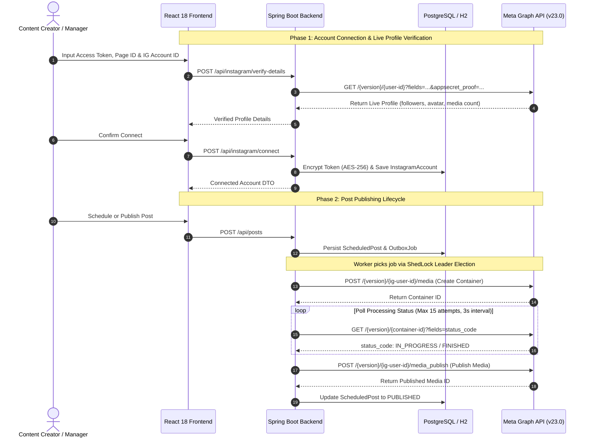
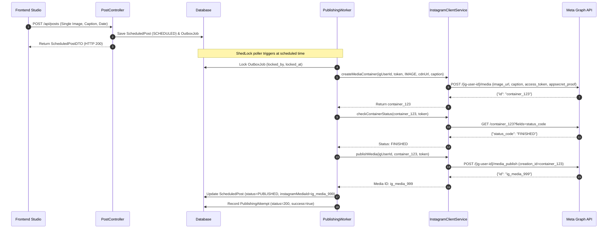
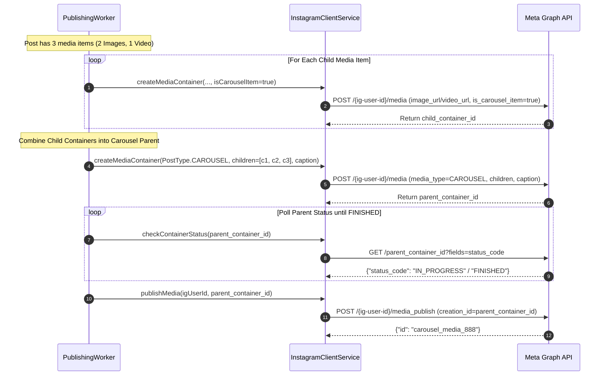

# InstaMngmt — Complete Endpoints & Meta Graph API Specification

## 1. Document Overview & Architectural Scope

This document provides a comprehensive, end-to-end technical reference for **all API endpoints** operating within the InstaMngmt ecosystem. The platform architecture operates across two distinct API tiers:

1. **Meta / Facebook Graph API Endpoints (Upstream Integration)**:
   * External REST APIs provided by Meta Platforms (v19.0 – v23.0) consumed by InstaMngmt backend services (`InstagramClientService`, `InstagramAuthService`, `InstagramPublishingWorker`).
   * Governs Instagram account authentication, profile intelligence retrieval, multi-format media container creation (Images, Reels, Carousels), asynchronous video transcoding polling, final media publishing, and token extension.

2. **InstaMngmt Application REST Endpoints (Internal Platform API)**:
   * Spring Boot 3 REST controllers exposed to the React 18 / TypeScript frontend.
   * Handles user authentication, RBAC, account linking, workspace grouping, media asset ingestion, post scheduling, bulk Excel batch processing, system telemetry, and Meta compliance webhooks.

3. **Fake Instagram API Simulator Monolith (Testing & Performance Tier - Port 8085)**:
   * Stateful mock service (`/fake-instagram-service`) capable of bulk generating 20,000+ accounts and 100,000+ posts in sub-seconds.
   * Reproduces the exact upstream Meta Graph API contracts and allows seamless switching between REAL and FAKE providers via `instagram.provider: real | fake`.
   * For complete details and simulation controls, see [FAKE_INSTAGRAM_SIMULATOR.md](file:///d:/JavaProjects/InstaMngmt/FAKE_INSTAGRAM_SIMULATOR.md).



---

## 2. Security Protocols, Cryptography & Rate Limiting

### 2.1 Meta `appsecret_proof` Security Architecture
To prevent man-in-the-middle attacks and token hijacking, all calls dispatched from the InstaMngmt backend to `graph.facebook.com` compute and append an `appsecret_proof` parameter:

$$\text{appsecret\_proof} = \text{HMAC-SHA256}(\text{access\_token}, \text{app\_secret})$$

* **Algorithm**: HMAC with SHA-256 hash function.
* **Key**: Application Secret (`instagram.app-secret`) configured in application environment variables.
* **Data**: Decrypted User or Page Access Token.
* **Output**: Hex-encoded 64-character digest.
* **Security Rationale**: Ensures that even if an access token is intercepted over the wire, it cannot be utilized outside of requests originating from the trusted backend server registered with Meta.

### 2.2 Token Encryption at Rest
* User access tokens are never persisted in plaintext.
* Before saving to the `instagram_accounts.access_token_encrypted` column, tokens are encrypted using **AES-256** symmetric key cryptography (`EncryptionUtil`).
* Decryption occurs solely in-memory within the backend JVM prior to dispatching HTTP requests to Meta.

### 2.3 Dual-Host Meta Routing Strategy
The Meta Graph API has two primary entry points depending on token provision:
1. `https://graph.instagram.com` (Instagram Basic Display / User-centric endpoints, tokens starting with `IG...`).
2. `https://graph.facebook.com` (Meta Business Graph API, standard page-scoped and system user tokens).

InstaMngmt implements an **automatic host failover mechanism**:
- Evaluates token prefix: tokens starting with `IG` target `graph.instagram.com` first; all others target `graph.facebook.com`.
- If an endpoint request fails on the primary host, the request automatically catches the exception, logs a diagnostic warning, and retries the request against the alternate host before declaring an error.

### 2.4 Rolling 24-Hour Rate Limit Ledger
* Meta strictly limits publishing velocity to **100 published posts per 24-hour rolling window** per connected Instagram account.
* The backend enforces this limit via `RateLimitService` backed by `RateLimitLedger`:
  * Evaluates attempts within the 24-hour window before initiating publishing.
  * If the limit is reached, posts are automatically marked `FAILED_RETRYABLE` and scheduled for deferred retry without consuming API quota.
  * Monitors `X-App-Usage` and `X-Business-Use-Case` response headers to preemptively back off when platform consumption crosses 80%.

### 2.5 Error Taxonomy & Resilience4j Circuit Breaker
The platform classifies all Meta HTTP and JSON error codes (`ErrorTaxonomyService`) to distinguish transient errors from terminal failures:

| Meta Error Code | Classification | System Action | Retry Behavior |
| :--- | :--- | :--- | :--- |
| `HTTP 5xx` | Transient Server Outage | Re-queue Outbox Job | Exponential backoff (15s, 30s, 60s) up to 3 attempts |
| `HTTP 429` | Rate Limit Exceeded | Deferred Retry | Defer execution by 1 hour |
| `Code 4` / `17` / `32` / `613` | App/User/Page Rate Limit | Deferred Retry | Retryable with dynamic exponential backoff |
| `CONTAINER_IN_PROGRESS` | Media Transcoding | Await Completion | Polled every 3 seconds up to 15 times (45 seconds max) |
| `Code 190` | Invalid / Expired Access Token | Terminal Auth Error | Mark account as `TOKEN_EXPIRED`; alert user for re-auth |
| `Code 100` | Invalid Parameter / Ratio | Terminal Request Error | Mark post as `FAILED_TERMINAL`; log human-readable reason |
| `Code 200` / `10` | Insufficient Permissions | Terminal Scope Error | Mark post as `FAILED_TERMINAL`; prompt permissions re-grant |
| `Code 368` | Policy Violation / Account Block | Terminal Compliance | Mark post as `FAILED_TERMINAL`; suspend account operations |

---

## 3. Meta / Facebook Graph API Endpoints Catalog (Consumed Upstream)

### 3.1 Fetch Account Details & Live Profile Metadata

#### Endpoint Information
* **Method**: `GET`
* **Target URLs**:
  * Primary: `https://graph.facebook.com/{version}/{ig-user-id}`
  * Alternate: `https://graph.instagram.com/{version}/me`
* **Triggered In Code**: [`InstagramClientService.fetchAccountDetails()`](file:///d:/JavaProjects/InstaMngmt/backend/src/main/java/com/instamngmt/service/InstagramClientService.java#L344) & [`executeFetchAccountDetails()`](file:///d:/JavaProjects/InstaMngmt/backend/src/main/java/com/instamngmt/service/InstagramClientService.java#L370)

#### Functional Purpose
Validates the Instagram credentials, checks token health, and pulls real-time profile metrics (follower count, following count, media count, biography, avatar URL, account type) for rendering the Profile Preview Popup and validating accounts during connection.

#### Prerequisites & Scopes Required
* `instagram_basic`
* `pages_show_list`
* `pages_read_engagement`
* Valid Meta Access Token (User Token or Page Access Token)

#### What We Send
* **Headers**: `Accept: application/json`
* **Query Parameters**:

| Parameter | Type | Required | Description |
| :--- | :--- | :--- | :--- |
| `fields` | String | Yes | Comma-separated fields: `id,username,name,profile_picture_url,followers_count,follows_count,media_count,biography,account_type` |
| `access_token` | String | Yes | Clean Meta Bearer access token |
| `appsecret_proof`| String | Conditional| HMAC-SHA256 hash (sent when targeting `graph.facebook.com`) |

#### What We Receive Back (Success - HTTP 200)
```json
{
  "id": "17841405309211844",
  "username": "techcorp_official",
  "name": "TechCorp Innovations",
  "profile_picture_url": "https://scontent.cdninstagram.com/v/t51.2885-19/sample_avatar.jpg",
  "followers_count": 48250,
  "follows_count": 312,
  "media_count": 184,
  "biography": "Enterprise cloud solutions & AI productivity tools.",
  "account_type": "BUSINESS"
}
```

#### What We Receive Back (Error - HTTP 400/401)
```json
{
  "error": {
    "message": "Error validating access token: Session has expired on Tuesday, 29-Sep-26 03:00:00 PDT.",
    "type": "OAuthException",
    "code": 190,
    "error_subcode": 463,
    "fbtrace_id": "AcZ987yX1_AbCdEf"
  }
}
```

---

### 3.2 Single Image Media Container Creation

#### Endpoint Information
* **Method**: `POST`
* **Target URLs**:
  * Primary: `https://graph.facebook.com/{version}/{ig-user-id}/media`
  * Alternate: `https://graph.instagram.com/{version}/me/media`
* **Triggered In Code**: [`InstagramClientService.createMediaContainer()`](file:///d:/JavaProjects/InstaMngmt/backend/src/main/java/com/instamngmt/service/InstagramClientService.java#L101)

#### Functional Purpose
Creates an asynchronous media container on Meta's servers for a single feed photo. The container downloads and validates the image from the provided public CDN URL before it can be published.

#### Prerequisites & Scopes Required
* `instagram_content_publish`
* Instagram Business or Creator account connected to a Facebook Page
* Publicly accessible image URL (JPEG/PNG/WEBP) hosted on the web (Meta cannot download from `localhost` or private subnets)

#### What We Send
* **Headers**: `Content-Type: application/x-www-form-urlencoded`
* **Form Parameters**:

| Parameter | Type | Required | Description |
| :--- | :--- | :--- | :--- |
| `image_url` | String | Yes | Publicly accessible HTTPS URL of the image |
| `caption` | String | No | Caption text including hashtags (max 2,200 characters) |
| `access_token` | String | Yes | Decrypted access token with publish permission |
| `appsecret_proof`| String | Conditional| HMAC-SHA256 hash |

#### What We Receive Back (Success - HTTP 200)
```json
{
  "id": "17928410293847561"
}
```

---

### 3.3 Video & Reels Media Container Creation

#### Endpoint Information
* **Method**: `POST`
* **Target URLs**:
  * Primary: `https://graph.facebook.com/{version}/{ig-user-id}/media`
  * Alternate: `https://graph.instagram.com/{version}/me/media`
* **Triggered In Code**: [`InstagramClientService.createMediaContainer()`](file:///d:/JavaProjects/InstaMngmt/backend/src/main/java/com/instamngmt/service/InstagramClientService.java#L148)

#### Functional Purpose
Creates a video media container for an Instagram Reel or Single Video post. Meta initiates an asynchronous server-side video transcoding pipeline to encode the video according to Instagram's bitrate and resolution standards.

#### Prerequisites & Scopes Required
* `instagram_content_publish`
* Video container specifications: MP4 or MOV, H.264 video codec, AAC audio codec, 16:9 vertical ratio for Reels (preferred 1080x1920), duration between 3 seconds and 15 minutes.

#### What We Send
* **Headers**: `Content-Type: application/x-www-form-urlencoded`
* **Form Parameters**:

| Parameter | Type | Required | Description |
| :--- | :--- | :--- | :--- |
| `media_type` | String | Yes | `REELS` for short-form video reels or `VIDEO` for feed videos |
| `video_url` | String | Yes | Publicly accessible direct HTTPS URL to the video file |
| `caption` | String | No | Post caption, hashtags, and mentions |
| `share_to_feed` | Boolean| No | Whether to show the Reel in the main profile grid (defaults to true) |
| `access_token` | String | Yes | Access token |
| `appsecret_proof`| String | Conditional| HMAC-SHA256 signature |

#### What We Receive Back (Success - HTTP 200)
```json
{
  "id": "18019283746501928"
}
```

---

### 3.4 Carousel Item (Child) Container Creation

#### Endpoint Information
* **Method**: `POST`
* **Target URL**: `https://graph.facebook.com/{version}/{ig-user-id}/media`
* **Triggered In Code**: [`InstagramPublishingWorker.executePublishing()`](file:///d:/JavaProjects/InstaMngmt/backend/src/main/java/com/instamngmt/service/InstagramPublishingWorker.java#L106)

#### Functional Purpose
Instagram Carousels require a two-phase container hierarchy. First, each individual item (photo or video, between 2 and 10 items) must be uploaded as a child container with `is_carousel_item=true`. Captions are omitted on individual child items.

#### What We Send
* **Headers**: `Content-Type: application/x-www-form-urlencoded`
* **Form Parameters**:

| Parameter | Type | Required | Description |
| :--- | :--- | :--- | :--- |
| `is_carousel_item`| Boolean| Yes | Must be set to `true` |
| `image_url` | String | Conditional| Required if item is an image |
| `video_url` | String | Conditional| Required if item is a video |
| `media_type` | String | Conditional| `VIDEO` if item is a video |
| `access_token` | String | Yes | Decrypted access token |
| `appsecret_proof`| String | Conditional| HMAC-SHA256 signature |

#### What We Receive Back (Success - HTTP 200)
```json
{
  "id": "17882930192837461"
}
```

---

### 3.5 Carousel Parent Container Creation

#### Endpoint Information
* **Method**: `POST`
* **Target URL**: `https://graph.facebook.com/{version}/{ig-user-id}/media`
* **Triggered In Code**: [`InstagramClientService.createMediaContainer()`](file:///d:/JavaProjects/InstaMngmt/backend/src/main/java/com/instamngmt/service/InstagramClientService.java#L154)

#### Functional Purpose
Combines the previously generated child container IDs (ordered 2 to 10 items) into a unified carousel parent container. The post-level caption and hashtags are assigned to this parent container.

#### What We Send
* **Headers**: `Content-Type: application/x-www-form-urlencoded`
* **Form Parameters**:

| Parameter | Type | Required | Description |
| :--- | :--- | :--- | :--- |
| `media_type` | String | Yes | Must be `CAROUSEL` |
| `children` | String | Yes | JSON array or comma-separated list of child container IDs (e.g. `["17882930192837461","17882930192837462"]`) |
| `caption` | String | No | Master caption for the entire carousel post |
| `access_token` | String | Yes | Access token |
| `appsecret_proof`| String | Conditional| HMAC-SHA256 signature |

#### What We Receive Back (Success - HTTP 200)
```json
{
  "id": "18099283746102938"
}
```

---

### 3.6 Check Container Status (Polling Transcoding Progress)

#### Endpoint Information
* **Method**: `GET`
* **Target URLs**:
  * Primary: `https://graph.facebook.com/{version}/{container-id}`
  * Alternate: `https://graph.instagram.com/{version}/{container-id}`
* **Triggered In Code**: [`InstagramClientService.checkContainerStatus()`](file:///d:/JavaProjects/InstaMngmt/backend/src/main/java/com/instamngmt/service/InstagramClientService.java#L205)

#### Functional Purpose
Media containers—especially videos and carousels—are processed asynchronously by Meta's infrastructure. Calling `/media_publish` while a container is still processing results in Meta Error `#9007 (Media upload has not completed yet)`. InstaMngmt polls this endpoint until the status reaches `FINISHED`.

#### What We Send
* **Headers**: `Accept: application/json`
* **Query Parameters**:

| Parameter | Type | Required | Description |
| :--- | :--- | :--- | :--- |
| `fields` | String | Yes | `status_code,status` |
| `access_token` | String | Yes | Meta access token |
| `appsecret_proof`| String | Conditional| HMAC-SHA256 signature |

#### What We Receive Back (Success - HTTP 200)
```json
{
  "status_code": "FINISHED",
  "id": "17928410293847561"
}
```

* **Possible `status_code` values**:
  * `IN_PROGRESS`: Transcoding/downloading is active. Worker sleeps 3 seconds and re-polls (up to 15 times).
  * `FINISHED`: Ready for publishing.
  * `ERROR`: Processing failed (e.g. invalid video codec or corrupt image).
  * `EXPIRED`: Container was not published within 24 hours and has expired.

---

### 3.7 Publish Media Container (`media_publish`)

#### Endpoint Information
* **Method**: `POST`
* **Target URLs**:
  * Primary: `https://graph.facebook.com/{version}/{ig-user-id}/media_publish`
  * Alternate: `https://graph.instagram.com/{version}/me/media_publish`
* **Triggered In Code**: [`InstagramClientService.publishMedia()`](file:///d:/JavaProjects/InstaMngmt/backend/src/main/java/com/instamngmt/service/InstagramClientService.java#L246)

#### Functional Purpose
The final publishing call that commits the verified media container to the live Instagram feed or Reels tab.

#### What We Send
* **Headers**: `Content-Type: application/x-www-form-urlencoded`
* **Form Parameters**:

| Parameter | Type | Required | Description |
| :--- | :--- | :--- | :--- |
| `creation_id` | String | Yes | The finished container ID |
| `access_token` | String | Yes | Meta access token with publish permission |
| `appsecret_proof`| String | Conditional| HMAC-SHA256 signature |

#### What We Receive Back (Success - HTTP 200)
```json
{
  "id": "18099482019482710"
}
```
* The returned `id` is the permanent, publicly accessible Instagram Media Object ID (`instagram_media_id`), which is stored in the database.

---

### 3.8 Long-Lived Token Exchange

#### Endpoint Information
* **Method**: `GET`
* **Target URL**: `https://graph.facebook.com/{version}/oauth/access_token`
* **Triggered In Code**: [`InstagramClientService.refreshLongLivedToken()`](file:///d:/JavaProjects/InstaMngmt/backend/src/main/java/com/instamngmt/service/InstagramClientService.java#L309)

#### Functional Purpose
Exchanges a short-lived user token (valid 1-2 hours) or refreshes an existing long-lived token for a new **60-day long-lived access token**.

#### What We Send
* **Query Parameters**:

| Parameter | Type | Required | Description |
| :--- | :--- | :--- | :--- |
| `grant_type` | String | Yes | Constant: `fb_exchange_token` |
| `client_id` | String | Yes | Meta App ID |
| `client_secret` | String | Yes | Meta App Secret |
| `fb_exchange_token`| String | Yes | Current active token |

#### What We Receive Back (Success - HTTP 200)
```json
{
  "access_token": "EAAQZAZC...long_lived_token...",
  "token_type": "bearer",
  "expires_in": 5184000
}
```

---

## 4. InstaMngmt Application REST API Endpoints Catalog (Spring Boot)

All endpoints are hosted on the Spring Boot 3 backend under `/api/...`. Authentication is handled via Bearer JWT in the `Authorization` header (`Authorization: Bearer <token>`).

---

### 4.1 Authentication Controller (`/api/auth`)

#### `POST /api/auth/register`
* **Purpose**: Direct user registration with email and password.
* **Access**: Public
* **Request Body**:
  ```json
  {
    "email": "creator@example.com",
    "password": "SecurePassword123!",
    "fullName": "Jane Doe"
  }
  ```
* **Response (HTTP 200)**:
  ```json
  {
    "token": "eyJhbGciOiJIUzI1NiIsIn...",
    "type": "Bearer",
    "id": 1,
    "email": "creator@example.com",
    "fullName": "Jane Doe",
    "role": "ROLE_USER",
    "plan": "FREE"
  }
  ```

#### `POST /api/auth/register-send-otp`
* **Purpose**: Initiates 2-step OTP registration flow by emailing a one-time passcode.
* **Access**: Public
* **Request Body**: `{"email": "creator@example.com"}`
* **Response (HTTP 200)**: `{"message": "OTP verification code sent to your email", "success": true}`

#### `POST /api/auth/verify-otp`
* **Purpose**: Verifies the OTP and activates the newly registered account.
* **Access**: Public
* **Request Body**:
  ```json
  {
    "email": "creator@example.com",
    "otp": "492810",
    "password": "SecurePassword123!",
    "fullName": "Jane Doe"
  }
  ```
* **Response (HTTP 200)**: Returns `AuthResponse` with JWT token.

#### `POST /api/auth/login`
* **Purpose**: Authenticates user credentials and issues a JWT token.
* **Access**: Public
* **Request Body**: `{"email": "creator@example.com", "password": "SecurePassword123!"}`
* **Response (HTTP 200)**: Returns `AuthResponse` with JWT token.

#### `POST /api/auth/forgot-password`
* **Purpose**: Triggers password reset email with recovery token.
* **Access**: Public
* **Request Body**: `{"email": "creator@example.com"}`
* **Response (HTTP 200)**: `{"message": "Password reset instructions sent", "success": true}`

#### `POST /api/auth/reset-password`
* **Purpose**: Completes password reset using verified token.
* **Access**: Public
* **Request Body**: `{"token": "reset_token_xyz", "newPassword": "NewSecurePassword456!"}`
* **Response (HTTP 200)**: `{"message": "Password updated successfully", "success": true}`

#### `POST /api/auth/upgrade-plan`
* **Purpose**: Upgrades the user's subscription tier (`FREE`, `PRO`, `ENTERPRISE`).
* **Access**: Authenticated User
* **Request Body**: `{"plan": "PRO"}`
* **Response (HTTP 200)**: Updated `UserDTO` with new account limits and storage caps.

#### `GET /api/auth/me`
* **Purpose**: Retrieves current authenticated user profile, tier, and quotas.
* **Access**: Authenticated User
* **Response (HTTP 200)**: Returns `UserDTO`.

---

### 4.2 Instagram Integration Controller (`/api/instagram`)

#### `POST /api/instagram/verify-details`
* **Purpose**: Pre-verifies Meta credentials with Meta Graph API before saving.
* **Access**: Authenticated User
* **Request Body**:
  ```json
  {
    "userId": "17841405309211844",
    "accessToken": "EAAQZAZC...meta_token..."
  }
  ```
* **Response (HTTP 200)**:
  ```json
  {
    "userId": "17841405309211844",
    "username": "techcorp_official",
    "profilePictureUrl": "https://scontent.cdninstagram.com/...jpg",
    "followersCount": 48250,
    "followingCount": 312,
    "mediaCount": 184,
    "biography": "Enterprise cloud solutions.",
    "valid": true,
    "message": "Instagram Account verified successfully via Graph API!"
  }
  ```

#### `POST /api/instagram/connect`
* **Purpose**: Persists a verified Instagram Business account for the user.
* **Access**: Authenticated User
* **Request Body**:
  ```json
  {
    "code": "EAAQZAZC...access_token...",
    "userId": "17841405309211844",
    "username": "techcorp_official",
    "facebookPageId": "104928172635412",
    "profilePictureUrl": "https://...",
    "followersCount": 48250,
    "followingCount": 312
  }
  ```
* **Response (HTTP 200)**: Returns `InstagramAccountDTO`.

#### `GET /api/instagram/accounts`
* **Purpose**: Returns all connected Instagram accounts for the current user with auto-synced live profile metadata.
* **Access**: Authenticated User
* **Response (HTTP 200)**: List of `InstagramAccountDTO`.

#### `GET /api/instagram/accounts/{id}`
* **Purpose**: Fetches a specific account by database ID.
* **Access**: Authenticated User (Account owner)
* **Response (HTTP 200)**: `InstagramAccountDTO`.

#### `DELETE /api/instagram/accounts/{id}`
* **Purpose**: Unlinks and removes the Instagram account.
* **Access**: Authenticated User (Account owner)
* **Response (HTTP 204)**: No Content.

#### `POST /api/instagram/accounts/{id}/refresh`
* **Purpose**: Manually triggers live Meta Graph API sync and refreshes long-lived token.
* **Access**: Authenticated User
* **Response (HTTP 200)**: Updated `InstagramAccountDTO`.

#### `PUT /api/instagram/accounts/{id}/token`
* **Purpose**: Updates access token, Facebook Page ID, or IG User ID in-place without unlinking.
* **Access**: Authenticated User
* **Request Body**: `{"accessToken": "EAAQZAZC...new_access_token..."}`
* **Response (HTTP 200)**: Updated `InstagramAccountDTO`.

---

### 4.3 Account Groups Controller (`/api/groups`)

#### `GET /api/groups`
* **Purpose**: Lists all account groups created by the authenticated user.
* **Access**: Authenticated User
* **Response (HTTP 200)**:
  ```json
  [
    {
      "id": 1,
      "groupName": "Retail Brands",
      "status": "ACTIVE",
      "accountIds": [1, 2],
      "createdAt": "2026-09-29T10:00:00"
    }
  ]
  ```

#### `POST /api/groups`
* **Purpose**: Creates a new account group.
* **Access**: Authenticated User
* **Request Body**:
  ```json
  {
    "groupName": "Retail Brands",
    "accountIds": [1, 2]
  }
  ```
* **Response (HTTP 200)**: Created `GroupDTO`.

#### `PUT /api/groups/{id}`
* **Purpose**: Modifies group name or updates member account IDs.
* **Access**: Authenticated User (Group owner)
* **Request Body**:
  ```json
  {
    "groupName": "Global Retail Brands",
    "accountIds": [1, 2, 4]
  }
  ```
* **Response (HTTP 200)**: Updated `GroupDTO`.

#### `DELETE /api/groups/{id}`
* **Purpose**: Deletes the specified account group.
* **Access**: Authenticated User (Group owner)
* **Response (HTTP 204)**: No Content.

---

### 4.4 Post Management & Bulk Excel Controller (`/api/posts`)

#### `POST /api/posts`
* **Purpose**: Schedules a new single post (Single Image, Carousel, Reel) or saves as draft.
* **Access**: Authenticated User
* **Request Body**:
  ```json
  {
    "instagramAccountId": 1,
    "caption": "Excited to launch our new product line! #innovation #saas",
    "postType": "SINGLE_IMAGE",
    "status": "SCHEDULED",
    "scheduledAt": "2026-10-05T14:30:00",
    "mediaIds": [10]
  }
  ```
* **Response (HTTP 200)**: Created `ScheduledPostDTO`.

#### `GET /api/posts`
* **Purpose**: Fetches all posts for the authenticated user with status and media details.
* **Access**: Authenticated User
* **Response (HTTP 200)**: List of `ScheduledPostDTO`.

#### `GET /api/posts/{id}`
* **Purpose**: Retrieves a specific scheduled post.
* **Access**: Authenticated User
* **Response (HTTP 200)**: `ScheduledPostDTO`.

#### `GET /api/posts/calendar`
* **Purpose**: Fetches scheduled and published posts across a date range for calendar views.
* **Access**: Authenticated User
* **Query Parameters**:
  * `start` (ISO DateTime, e.g. `2026-10-01T00:00:00`)
  * `end` (ISO DateTime, e.g. `2026-10-31T23:59:59`)
* **Response (HTTP 200)**: List of `ScheduledPostDTO`.

#### `PUT /api/posts/{id}`
* **Purpose**: Updates caption, post type, or scheduled time for a pending post.
* **Access**: Authenticated User
* **Request Body**:
  ```json
  {
    "caption": "Updated caption text #updated",
    "postType": "SINGLE_IMAGE",
    "scheduledAt": "2026-10-06T15:00:00"
  }
  ```
* **Response (HTTP 200)**: Updated `ScheduledPostDTO`.

#### `POST /api/posts/{id}/publish-now`
* **Purpose**: Bypasses the schedule queue and immediately dispatches the post to Meta.
* **Access**: Authenticated User
* **Response (HTTP 200)**: `ScheduledPostDTO` (updated status).

#### `POST /api/posts/{id}/cancel`
* **Purpose**: Cancels a pending scheduled post.
* **Access**: Authenticated User
* **Response (HTTP 200)**: `ScheduledPostDTO` (`status: CANCELLED`).

#### `POST /api/posts/{id}/retry`
* **Purpose**: Re-queues a failed post for immediate retry.
* **Access**: Authenticated User
* **Response (HTTP 200)**: `ScheduledPostDTO` (`status: SCHEDULED`).

#### `DELETE /api/posts/{id}`
* **Purpose**: Deletes a post record and its associated outbox jobs.
* **Access**: Authenticated User
* **Response (HTTP 204)**: No Content.

#### `GET /api/posts/excel-template`
* **Purpose**: Downloads the standardized `.xlsx` bulk scheduling spreadsheet template with native dropdown validation.
* **Access**: Authenticated User
* **Response (HTTP 200)**: Binary `.xlsx` stream (`Content-Disposition: attachment; filename=instagram_posts_template.xlsx`).

#### `POST /api/posts/upload-excel`
* **Purpose**: Ingests, parses, and validates an uploaded Excel file, returning valid/invalid rows and error diagnostics.
* **Access**: Authenticated User
* **Form Data**: `file` (Multipart `.xlsx` file)
* **Response (HTTP 200)**:
  ```json
  {
    "batchId": "BATCH-9a1b2c3d",
    "totalRows": 25,
    "validRows": 23,
    "invalidRows": 2,
    "previewRows": [
      {
        "rowNumber": 2,
        "valid": true,
        "instagramAccountId": 1,
        "postType": "IMAGE",
        "scheduleDateStr": "2026-10-10",
        "scheduleTimeStr": "15:30:00",
        "scheduledTimeStr": "2026-10-10 15:30:00",
        "caption": "Autumn specials are here!",
        "mediaUrl": "https://images.unsplash.com/photo-1507525428034-b723cf961d3e",
        "validationErrors": []
      },
      {
        "rowNumber": 3,
        "valid": false,
        "validationErrors": ["[Schedule Time] Invalid time format. Must be HH:mm:ss"]
      }
    ]
  }
  ```

#### `POST /api/posts/commit-excel-batch`
* **Purpose**: Commits validated preview rows to the database using multithreaded batch processing.
* **Access**: Authenticated User
* **Request Body**:
  ```json
  {
    "batchId": "BATCH-9a1b2c3d",
    "rows": [ /* list of validated row objects */ ]
  }
  ```
* **Response (HTTP 200)**:
  ```json
  {
    "batchId": "BATCH-9a1b2c3d",
    "totalCommitted": 23,
    "status": "COMPLETED",
    "message": "Successfully scheduled 23 posts via multithreaded worker."
  }
  ```

---

### 4.5 Media Asset Controller (`/api/media`)

#### `POST /api/media`
* **Purpose**: Ingests media file (image or video), analyzes dimensions/duration, and saves to storage.
* **Access**: Authenticated User
* **Form Data**:
  * `file`: Binary file
  * `mediaType`: `IMAGE` or `VIDEO` (optional)
  * `width`: Integer (optional)
  * `height`: Integer (optional)
  * `durationSeconds`: Double (optional)
* **Response (HTTP 200)**: `MediaDTO`.

#### `GET /api/media`
* **Purpose**: Retrieves all media assets uploaded by the current user.
* **Access**: Authenticated User
* **Response (HTTP 200)**: List of `MediaDTO`.

#### `GET /api/media/{id}`
* **Purpose**: Retrieves media asset details by ID.
* **Access**: Authenticated User
* **Response (HTTP 200)**: `MediaDTO`.

#### `DELETE /api/media/{id}`
* **Purpose**: Deletes media asset from database and removes underlying file from storage.
* **Access**: Authenticated User
* **Response (HTTP 204)**: No Content.

---

### 4.6 Dashboard Telemetry Controller (`/api/dashboard`)

#### `GET /api/dashboard`
* **Purpose**: Aggregates high-level metrics for the Publishing Command Center dashboard.
* **Access**: Authenticated User
* **Response (HTTP 200)**:
  ```json
  {
    "totalPostsPublished": 142,
    "totalScheduledPosts": 18,
    "activeAccountsCount": 4,
    "failedPostsCount": 1,
    "storageUsedBytes": 52428800,
    "storageLimitBytes": 2147483648,
    "storagePercentage": 2.44,
    "accountHealthList": [
      {
        "accountId": 1,
        "username": "techcorp_official",
        "status": "ACTIVE",
        "daysUntilExpiry": 48
      }
    ],
    "recentActivity": [
      {
        "postId": 89,
        "accountUsername": "techcorp_official",
        "action": "PUBLISHED",
        "timestamp": "2026-09-29T14:00:00"
      }
    ]
  }
  ```

---

### 4.7 Site Settings & Administration Controller (`/api/settings`)

#### `GET /api/settings/public`
* **Purpose**: Exposes non-sensitive platform configurations (e.g. OTP requirement) to unauthenticated frontend visitors.
* **Access**: Public
* **Response (HTTP 200)**:
  ```json
  {
    "registrationOtpEnabled": false,
    "maintenanceMode": false,
    "appName": "InstaMngmt"
  }
  ```

#### `GET /api/settings/admin`
* **Purpose**: Fetches all key-value platform configurations.
* **Access**: Admin Only (`ROLE_ADMIN`)
* **Response (HTTP 200)**: List of `SettingResponse`.

#### `PUT /api/settings/admin/{key}`
* **Purpose**: Updates an existing site setting value.
* **Access**: Admin Only (`ROLE_ADMIN`)
* **Request Body**: `{"value": "true"}`
* **Response (HTTP 200)**: Updated `SettingResponse`.

#### `POST /api/settings/admin/toggle-otp`
* **Purpose**: Dedicated shortcut to toggle user registration OTP requirement.
* **Access**: Admin Only (`ROLE_ADMIN`)
* **Query Parameters**: `enabled=true|false`
* **Response (HTTP 200)**: Updated `SettingResponse`.

---

### 4.8 Meta Webhooks Controller (`/api/webhooks`)

#### `GET /api/webhooks/instagram`
* **Purpose**: Responds to Meta Webhooks challenge verification handshake.
* **Access**: Public (Meta Crawler)
* **Query Parameters**:
  * `hub.mode`: Verification mode (e.g. `subscribe`)
  * `hub.verify_token`: Verification secret configured in Meta App Dashboard
  * `hub.challenge`: Random challenge integer string sent by Meta
* **Response (HTTP 200)**: Raw challenge string echo (text/plain).

#### `POST /api/webhooks/deauthorize`
* **Purpose**: Handles Meta Deauthorization Callback when a user revokes app permissions from Facebook settings.
* **Access**: Public (Meta Server Callback)
* **Request Body**:
  ```json
  {
    "user_id": "17841405309211844"
  }
  ```
* **Response (HTTP 200)**:
  ```json
  {
    "status": "success"
  }
  ```
* **Backend Action**: Finds account matching `igUserId` and updates status to `DEAUTHORIZED`.

#### `POST /api/webhooks/data-deletion`
* **Purpose**: Handles Meta GDPR Data Deletion Callback.
* **Access**: Public (Meta Server Callback)
* **Request Body**:
  ```json
  {
    "user_id": "17841405309211844"
  }
  ```
* **Response (HTTP 200)**:
  ```json
  {
    "url": "https://your-domain.com/data-deletion-status?id=DEL_3f91a2bc",
    "confirmation_code": "DEL_3f91a2bc"
  }
  ```

---

## 5. End-to-End Sequence Walkthroughs

### 5.1 Single Image Post Publishing Sequence



### 5.2 Carousel Post Publishing Sequence



---

## 6. Summary Matrix of Endpoints

| Category | Endpoint / Path | Target System | Auth Type | Primary Output |
| :--- | :--- | :--- | :--- | :--- |
| **Meta Graph** | `GET /{version}/{user-id}` | Meta Servers | Bearer Token + Proof | Live Profile Intelligence |
| **Meta Graph** | `POST /{version}/{user-id}/media` | Meta Servers | Bearer Token + Proof | Media Container ID |
| **Meta Graph** | `GET /{version}/{container-id}` | Meta Servers | Bearer Token + Proof | Transcoding Status Code |
| **Meta Graph** | `POST /{version}/{user-id}/media_publish` | Meta Servers | Bearer Token + Proof | Permanent Instagram Media ID |
| **Meta Graph** | `GET /{version}/oauth/access_token` | Meta Servers | App Credentials | 60-Day Long-Lived Token |
| **App Auth** | `POST /api/auth/register` | Spring Boot | None (Public) | JWT Auth Response |
| **App Auth** | `POST /api/auth/login` | Spring Boot | None (Public) | JWT Auth Response |
| **App Auth** | `POST /api/auth/upgrade-plan` | Spring Boot | Bearer JWT | Upgraded User Details |
| **App Instagram** | `POST /api/instagram/verify-details` | Spring Boot | Bearer JWT | Live Verified Account Data |
| **App Instagram** | `POST /api/instagram/connect` | Spring Boot | Bearer JWT | Linked Account Record |
| **App Instagram** | `GET /api/instagram/accounts` | Spring Boot | Bearer JWT | Account List with Live Sync |
| **App Instagram** | `PUT /api/instagram/accounts/{id}/token` | Spring Boot | Bearer JWT | Updated Account Record |
| **App Groups** | `GET /api/groups` | Spring Boot | Bearer JWT | Workspace Group List |
| **App Groups** | `POST /api/groups` | Spring Boot | Bearer JWT | New Workspace Group |
| **App Posts** | `POST /api/posts` | Spring Boot | Bearer JWT | Scheduled Post Record |
| **App Posts** | `GET /api/posts/calendar` | Spring Boot | Bearer JWT | Calendar Post Array |
| **App Posts** | `POST /api/posts/upload-excel` | Spring Boot | Bearer JWT | Validation Preview & Errors |
| **App Posts** | `POST /api/posts/commit-excel-batch` | Spring Boot | Bearer JWT | Batch Execution Summary |
| **App Media** | `POST /api/media` | Spring Boot | Bearer JWT | Saved Media Asset DTO |
| **App Dashboard** | `GET /api/dashboard` | Spring Boot | Bearer JWT | Aggregated Telemetry DTO |
| **App Settings** | `GET /api/settings/public` | Spring Boot | None (Public) | Public Site Flags |
| **App Settings** | `POST /api/settings/admin/toggle-otp` | Spring Boot | Bearer JWT (Admin) | Updated Setting Record |
| **Compliance** | `GET /api/webhooks/instagram` | Spring Boot | Webhook Token | Challenge Echo String |
| **Compliance** | `POST /api/webhooks/deauthorize` | Spring Boot | Meta Signature | Deauthorization Status |
| **Compliance** | `POST /api/webhooks/data-deletion` | Spring Boot | Meta Signature | GDPR Deletion Response |
