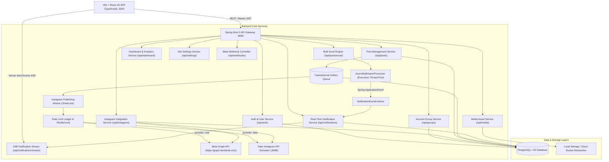

# InstaPulse — Enterprise Instagram Management & Scheduling Suite

[](https://adoptium.net/)
[](https://spring.io/projects/spring-boot)
[](https://react.dev/)
[](https://www.typescriptlang.org/)
[](https://vitejs.dev/)
[](https://tailwindcss.com/)
[](LICENSE)

**InstaPulse (InstaMngmt)** is an enterprise-grade Instagram Content Scheduling, Bulk Ingestion, and Multi-Account Publishing Platform. Built with a high-performance **Java 21 / Spring Boot 3** backend and a reactive **React 18 / TypeScript / Vite** frontend with custom glassmorphism styling, InstaPulse empowers digital agencies, social media teams, and creators to curate, organize, schedule, and reliably publish content (Single Images, Carousels, and Reels) via Meta's Graph API.

The platform includes an embedded **Fake Instagram API Simulator Monolith** (`:8085`) allowing the entire platform to be stress-tested at extreme scale (20,000+ accounts and 100,000+ posts) with zero real Meta credentials, CDN media dependencies, or API rate limitations.

---

## 🏗️ High-Level System Architecture



---

## ✨ Key Feature Highlights

### 1. 👥 Multi-Account Intelligence & Live Sync
* **Pre-Connection Verification**: Live credential pre-flight check validates tokens and fetches profile stats before saving to the database.
* **Auto-Sync Engine**: Real-time sync of live follower counts, following, bio, category, and profile avatars directly from Graph API.
* **Token Health & Expiration Countdown**: Interactive countdown timer highlighting token lifespan with color-coded alerts (Healthy, Expiring Soon, Critical, Expired).
* **In-Place Credential Editing**: Dedicated modal to refresh tokens without breaking existing scheduled queues.
* **Workspace Account Groups**: Organize accounts by client, brand, or campaign with member tagging and filtered views.

### 2. ⚡ High-Throughput Bulk Excel Ingestion Engine
* **Excel Template Generator**: One-click download of `.xlsx` template formatted with dedicated Date & Time columns.
* **Apache POI Validation**: Validates image aspect ratios, date/time constraints, and account mappings in memory with error summaries.
* **Asynchronous Batch Processor (`AsyncBulkImportProcessor`)**: Large imports (> 199 rows) automatically offload to a 10-thread worker pool, returning immediate HTTP 200 responses to prevent gateway timeouts.
* **Real-Time SSE Progress Delivery**: Background workers dispatch Spring `NotificationEvent`s streamed directly to user browser sessions.

### 3. 🔔 Real-Time Notification Center & Toast System
* **Server-Sent Events (SSE)**: Persistent stream (`/api/notifications/stream`) delivers instantaneous updates without polling overhead.
* **Interactive Notification Dropdown**: Bell icon with unread badge count, severity tabs (`INFO`, `SUCCESS`, `WARNING`, `ERROR`), unread filtering, and batch actions ("Mark All Read", "Clear Read").
* **Floating Toasts**: Auto-dismissing and actionable alerts for publishing successes, token warnings, and background imports.

### 4. 🛡️ Publishing Command Center & Resilience Architecture
* **Transactional Outbox & ShedLock Election**: Distributed locking guarantees zero duplicate posts across clustered nodes.
* **Forensic Audit Diagnostics**: Drill-down modal inspecting Meta API HTTP response codes, error taxonomies, request payloads, and attempt logs.
* **Rate Limit Ledger**: Active tracking of Meta Graph API quotas (`X-App-Usage` / `X-Business-Use-Case`) integrated with Resilience4j circuit breakers and exponential backoff retry mechanics.

### 5. 🧪 Embedded Fake Instagram API Simulator Monolith
* **Zero-Credential Testing**: Runs independently on port `8085` reproducing all Meta Graph API endpoints.
* **Extreme Scale Generator**: Generate 1,000, 10,000, or 20,000+ accounts with 100,000+ posts in sub-seconds.
* **Predefined Chaos Scenarios**: 1-click simulation of `RATE_LIMITED` (HTTP 429), `TOKEN_FAILURE` (HTTP 401), and `SLOW_API` latency spikes.

---

## 🚀 Quick Start Guide

### Prerequisites
* **Java 21 JDK** (Eclipse Adoptium Temurin recommended)
* **Node.js 18+** & **npm**
* **Apache Maven 3.9+**

---

### Step 1: Start the Fake Instagram Simulator (Port 8085)
```powershell
cd fake-instagram-service
mvn spring-boot:run
```
*Accessible at [http://localhost:8085/](http://localhost:8085/)*

---

### Step 2: Start the Backend Service (Port 8080)

#### Option A: Test Mode (Recommended — Connects to Fake Simulator)
```powershell
cd backend
mvn spring-boot:run "-Dspring-boot.run.profiles=test"
```
*Uses isolated H2 test database (`./data/instamngmttestdb`) and points to the Fake Instagram Simulator on `:8085`.*

#### Option B: Standard / Production Mode (Connects to Real Meta Graph API)
```powershell
cd backend
mvn spring-boot:run
```

---

### Step 3: Start the Frontend Application (Port 3000)
```powershell
cd frontend
npm install
npm run dev
```
*Web App accessible at [http://localhost:3000/](http://localhost:3000/)*

---

## 🔑 Default Credentials & Access Endpoints

| Portal | URL | Credentials / Notes |
| :--- | :--- | :--- |
| **Frontend Web App** | [http://localhost:3000/](http://localhost:3000/) | Email: `admin@instamngmt.com`<br>Password: `admin` |
| **Backend API Gateway** | [http://localhost:8080/](http://localhost:8080/) | Public settings: `/api/settings/public` |
| **H2 Database Console** | [http://localhost:8080/h2-console](http://localhost:8080/h2-console) | JDBC URL: `jdbc:h2:file:./data/instamngmttestdb`<br>User: `sa`, Password: `password` |
| **Fake Instagram Admin Dashboard** | [http://localhost:8085/](http://localhost:8085/) | Embedded simulation controls & benchmarks |

---

## 📂 Repository Structure

```
InstaMngmt/
├── backend/                             # Java 21 / Spring Boot 3 Core Backend
│   ├── src/main/java/com/instamngmt/
│   │   ├── config/                      # Security, CORS, Async & Encryption Config
│   │   ├── controller/                  # REST Controllers (Auth, Instagram, Posts, Notifications, etc.)
│   │   ├── dto/                         # Request / Response Transfer Objects
│   │   ├── entity/                      # JPA Entities (ScheduledPost, Notification, etc.)
│   │   ├── event/                       # Spring Event-Driven Notification System
│   │   ├── repository/                  # Spring Data JPA Repositories
│   │   ├── scheduler/                   # ShedLock Worker & Token Expiration Poller
│   │   ├── security/                    # JWT Filters & RBAC Evaluation
│   │   └── service/                     # Business Logic & Async Bulk Import Engine
│   └── src/main/resources/
│       ├── application.yml              # Base Configuration
│       ├── application-dev.yml          # Development Profile
│       └── application-test.yml         # Test Profile (pointing to Simulator :8085)
├── fake-instagram-service/              # Standalone Meta Graph API Mock Monolith (:8085)
│   ├── src/main/java/com/fakeinstagram/
│   │   ├── controller/                  # Mock /{version}/* & /admin/* endpoints
│   │   ├── filter/                      # SimulationFilter (Chaos, Delays, 429)
│   │   └── service/                     # High-Speed Account & Post Generator
├── frontend/                            # React 18 / TypeScript / Vite Client (:3000)
│   ├── src/
│   │   ├── components/                  # NotificationCenter, Toast, PostModals, Navbar, etc.
│   │   ├── context/                     # AuthContext & NotificationContext
│   │   ├── hooks/                       # useNotifications SSE hook
│   │   ├── pages/                       # Dashboard, Post Studio, Accounts, Settings, etc.
│   │   ├── services/                    # Axios API Clients & SSE Stream Connector
│   │   └── types/                       # TypeScript Data Models
├── DOCUMENTATION.md                     # Full System Architecture & Functional Specification
├── ENDPOINTS_DOCUMENTATION.md           # Comprehensive API Contract & Payload Specification
└── FAKE_INSTAGRAM_SIMULATOR.md          # Simulator Architecture, Benchmarks & Scenario Matrix
```

---

## 📚 Technical Documentation Index

For exhaustive technical references, inspect the dedicated architecture files:
* **[DOCUMENTATION.md](DOCUMENTATION.md)** — Architectural design, ER diagrams, subscription tiers, outbox patterns, and non-functional requirements.
* **[ENDPOINTS_DOCUMENTATION.md](ENDPOINTS_DOCUMENTATION.md)** — Every endpoint contract, request/response schema, curl examples, sequence diagrams, and webhook specifications.
* **[FAKE_INSTAGRAM_SIMULATOR.md](FAKE_INSTAGRAM_SIMULATOR.md)** — Simulator benchmarks (20k accounts in 3.1s), chaos scenarios, and endpoint mappings.

---

## 📄 License
This project is licensed under the MIT License — see the LICENSE file for details.
